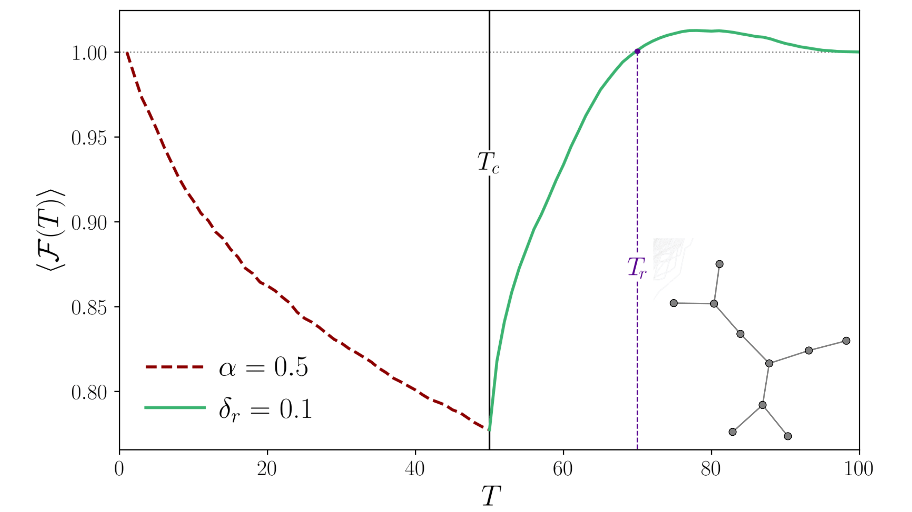
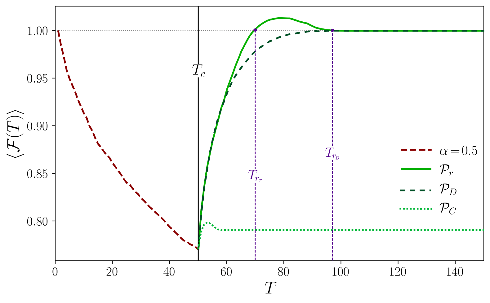

# Recuperación estratégica de sistemas complejos con daño

**Tesis de pregrado en Física - Universidad Nacional de Colombia**  

**Autora: Angie Antivar González**  

**Asesor: Alejandro Pérez Riascos**  

**Fecha: Marzo de 2025**

## 📘 Resumen

Este trabajo propone una estrategia para recuperar redes complejas afectadas por daño acumulado, fenómeno que deteriora progresivamente las conexiones de un sistema. A partir del diseño de un algoritmo propio, se plantea una metodología que prioriza intervenciones en los vínculos más críticos de la red, combinando métricas estructurales y de daño para asignar recursos de manera eficiente. La estrategia fue implementada y validada en redes de transporte urbano, mostrando su capacidad para identificar zonas vulnerables y dirigir esfuerzos hacia componentes clave. Este trabajo ofrece una herramienta adaptable para abordar procesos de recuperación en distintos tipos de sistemas complejos.

📄 Puedes leer el documento completo aquí:  
[Tesis Angie Antivar (PDF)](Tesis_Pregrado_Angie_Antivar.pdf)

### 📊 Resultados principales

La estrategia de recuperación propuesta fue implementada en la red de metro de Toronto, afectada por daño acumulado. Los resultados muestran que el algoritmo logra **restaurar y mejorar** la funcionalidad del sistema incluso bajo condiciones de recursos limitados, y es más eficiente que estrategias tradicionales.

#### 🟢 Recuperación eficiente y antifragilidad

Durante la fase de recuperación, el algoritmo basado en el índice conjunto (Pr(ε)) no solo permitió alcanzar nuevamente el nivel de funcionalidad original, sino que superó dicho valor, mejorando temporalmente el rendimiento del sistema. Este fenómeno, conocido como **antifragilidad**, indica que el sistema puede beneficiarse del daño al ser reparado de manera estratégica.

*Figura 1: Evolución de la funcionalidad promedio ⟨F(T)⟩ de la red de metro de Toronto. El sistema se recupera completamente tras 20 pasos y alcanza un estado antifrágil, con funcionalidad superior al nivel original.*

#### 🔍 Comparación con otras estrategias

Se comparó la estrategia propuesta con dos métodos alternativos: uno que prioriza solo el daño (PD(ε)) y otro que prioriza solo la centralidad estructural (PC(ε)). El algoritmo con índice conjunto demostró ser más rápido y efectivo, alcanzando y superando la funcionalidad óptima en menos pasos, mientras que las estrategias alternativas no lograron esta mejora.

*Figura 2: Comparación entre estrategias de recuperación. Solo el enfoque propuesto logra restaurar completamente el sistema y generar estados con funcionalidad mejorada o antifrágiles.*

## ⚠️ Sobre el código

Este repositorio **no contiene el código** del algoritmo desarrollado en esta investigación, ya que está en proceso de publicación científica. Para más información, puedes contactarme.

## 🧾 _Licencia_

Este trabajo está licenciado bajo una **Creative Commons Atribución-NoComercial-SinDerivadas 4.0 Internacional (CC BY-NC-ND 4.0)**.  
Consulta los términos aquí:  
[https://creativecommons.org/licenses/by-nc-nd/4.0/deed.es](https://creativecommons.org/licenses/by-nc-nd/4.0/deed.es)
